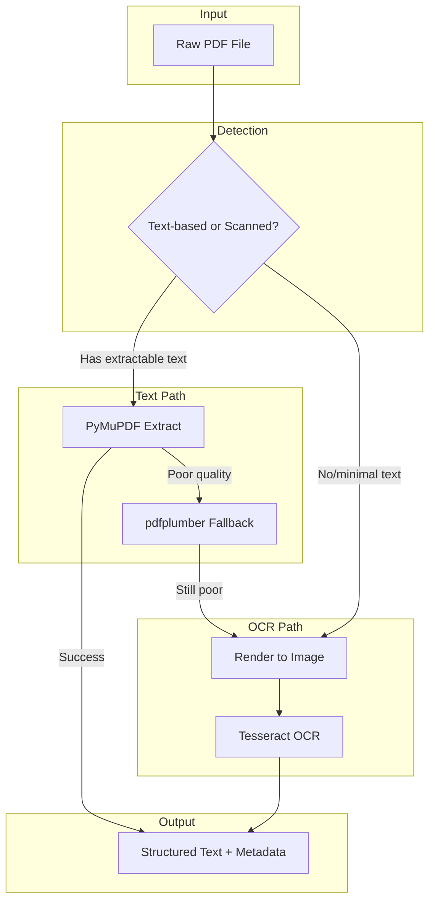

# Day 1: PDF Processing Fundamentals

## Learning Objectives

By the end of this day, you will be able to:

1. **Distinguish** between text-based and scanned PDFs and select appropriate processing strategies
2. **Implement** a dual-path PDF ingestion pipeline (text extraction vs OCR)
3. **Use** PyMuPDF and pdfplumber for production-grade PDF parsing
4. **Design** a pipeline that handles layout complexities (multi-column, headers, footers)
5. **Evaluate** parsing quality and implement fallback logic

---

## 1. Theory

### 1.1 Text-Based vs Scanned PDFs

**Text-Based PDFs** store character glyphs as embedded text objects. Each character has:
- Unicode codepoint
- Position (x, y) on page
- Font metadata
- Optional content streams

Extraction is **deterministic** and **fast**. Tools read the PDF structure directly.

**Scanned PDFs** are images of pages. Each page is a bitmap (raster). Text is pixels only. Extraction requires **Optical Character Recognition (OCR)**—a probabilistic, compute-heavy process.

| Attribute | Text-Based | Scanned |
|-----------|------------|---------|
| Extraction method | Parse PDF structure | OCR (Tesseract, etc.) |
| Latency | ~10–50ms/page | ~500–2000ms/page |
| Accuracy | ~100% (given clean encoding) | 95–99% (domain-dependent) |
| Table handling | Structure may exist | Must be detected from layout |
| Failure mode | Encoding issues, corrupt streams | Poor scan quality, handwriting |

### 1.2 PDF Internal Structure (Simplified)

```
PDF Document
├── Header (%PDF-1.7)
├── Body
│   ├── Page 1
│   │   ├── Content stream (drawing commands)
│   │   ├── Resources (fonts, images)
│   │   └── MediaBox (page dimensions)
│   ├── Page 2
│   └── ...
├── Cross-reference table
└── Trailer
```

**Content streams** use a stack-based language:
```
BT                    % Begin text
/F1 12 Tf             % Font F1, size 12
100 700 Td            % Position
(Hello) Tj            % Show "Hello"
ET                    % End text
```

Different PDF generators encode text differently. Some use:
- **CID fonts** (CJK, complex scripts)
- **Embedded subsets** (subset fonts)
- **Custom encoding** (non-standard maps)

### 1.3 Tool Comparison: PyMuPDF vs pdfplumber

| Aspect | PyMuPDF (fitz) | pdfplumber |
|--------|----------------|------------|
| **Speed** | Fastest (C backend) | Slower (Python) |
| **Text extraction** | Excellent | Good |
| **Table extraction** | Basic (blocks) | Excellent (line detection) |
| **Layout preservation** | Block/line/span | Character-level |
| **Image extraction** | Native | Via pdf2image |
| **Memory** | Low | Moderate |
| **License** | AGPL (commercial available) | MIT |

**Architectural Decision**: Use PyMuPDF for high-throughput text extraction; use pdfplumber when table structure is critical.

---

## 2. Architecture

### 2.1 PDF Ingestion Pipeline (Day 1 Scope)



### 2.2 Text vs Scanned Detection Heuristics

1. **Character count**: Extract text; if < N chars per page (e.g., 50), likely scanned
2. **Font usage**: Text PDFs reference font objects; scanned PDFs may have none
3. **Image ratio**: Scanned pages are often one large image per page
4. **Hybrid**: Some pages text, others scanned—detect per-page

```python
# Pseudocode for detection
def is_text_based(pdf_path: str, min_chars_per_page: int = 50) -> bool:
    doc = fitz.open(pdf_path)
    total_chars = sum(len(page.get_text()) for page in doc)
    doc.close()
    return total_chars / len(doc) >= min_chars_per_page
```

---

## 3. Mathematical Intuition

### 3.1 OCR Confidence (Tesseract)

Tesseract returns per-word confidence 0–100. For quality filtering:

$$\text{QualityScore} = \frac{1}{N} \sum_{i=1}^{N} \frac{\text{conf}_i}{100}$$

Threshold: reject pages with `QualityScore < 0.85` for critical pipelines.

### 3.2 Layout-Aware Extraction

Text blocks have bounding boxes $(x_0, y_0, x_1, y_1)$. Reading order can be inferred by:
- **Top-to-bottom, left-to-right** (LTR): sort by $y_0$ (primary), then $x_0$ (secondary)
- **Multi-column**: cluster blocks by $x$ position; sort columns, then within column

---

## 4. Production Considerations

| Consideration | Approach |
|---------------|----------|
| **Large files** | Stream processing; avoid loading entire PDF into memory |
| **Corrupt PDFs** | Try multiple libraries; log and quarantine |
| **Encoding** | Normalize to UTF-8; handle Latin-1, CP1252, etc. |
| **Rate limiting** | OCR is CPU-bound; use worker pool with concurrency limits |
| **Idempotency** | Hash input; skip if already processed |
| **Storage** | Store raw PDF in blob store; metadata + extracted text in DB |

---

## 5. Coding Lab

### Lab 5.1: Setup and Basic Extraction

```python
# labs/week1/day01_basic_pdf.py
import fitz  # PyMuPDF
from pathlib import Path
from dataclasses import dataclass
from typing import Optional

@dataclass
class PageContent:
    page_num: int
    text: str
    char_count: int
    images_count: int

def extract_text_pymupdf(pdf_path: Path) -> list[PageContent]:
    doc = fitz.open(pdf_path)
    pages = []
    for i, page in enumerate(doc):
        text = page.get_text()
        images = page.get_images()
        pages.append(PageContent(
            page_num=i + 1,
            text=text.strip(),
            char_count=len(text),
            images_count=len(images)
        ))
    doc.close()
    return pages

def detect_pdf_type(pages: list[PageContent], min_chars: int = 50) -> str:
    avg_chars = sum(p.char_count for p in pages) / max(len(pages), 1)
    return "text" if avg_chars >= min_chars else "scanned"
```

### Lab 5.2: pdfplumber Table Extraction

```python
# labs/week1/day01_pdfplumber_tables.py
import pdfplumber
from pathlib import Path

def extract_tables(pdf_path: Path) -> list[dict]:
    results = []
    with pdfplumber.open(pdf_path) as pdf:
        for i, page in enumerate(pdf.pages):
            tables = page.extract_tables()
            for j, table in enumerate(tables or []):
                results.append({
                    "page": i + 1,
                    "table_id": j,
                    "rows": table,
                    "bbox": page.find_tables()[j].bbox if page.find_tables() else None
                })
    return results
```

### Lab 5.3: Header/Footer Removal Heuristic

Headers/footers often occupy top/bottom 10–15% of page height:

```python
def remove_headers_footers(page, page_height: float, margin_ratio: float = 0.12):
    margin = page_height * margin_ratio
    blocks = page.get_text("dict")["blocks"]
    filtered = []
    for block in blocks:
        bbox = block["bbox"]
        # Skip if in top or bottom margin
        if bbox[1] < margin or bbox[3] > page_height - margin:
            continue
        filtered.append(block)
    return filtered
```

---

## 6. Homework

1. **Implement** a unified `extract_pdf(pdf_path) -> Document` that:
   - Detects text vs scanned
   - Uses PyMuPDF for text, Tesseract for scanned (install `pytesseract`, `pdf2image`)
   - Returns a structured object with pages, metadata, and extraction method used

2. **Benchmark** extraction speed: 10 text PDFs vs 10 scanned PDFs. Report docs/sec.

3. **Research** Apache Tika—how does it compare? When would you use it?

---

## 7. Interview-Style Questions

**Q1:** How would you design a PDF ingestion pipeline for 1M documents with mixed text/scanned?

**A:** Dual-path pipeline with per-page detection. Text path: PyMuPDF, high concurrency. OCR path: Celery workers, GPU if available. Store hashes for dedup. Batch similar documents for cache efficiency.

**Q2:** What causes "garbled" text in PDF extraction?

**A:** Custom encodings, CID fonts with wrong CMap, rotated text, form XObjects, inline images masquerading as text. Mitigation: try multiple extractors, fallback to OCR.

**Q3:** How do you handle PDFs with both text and images (e.g., figures with captions)?

**A:** Extract text blocks with bounding boxes. Extract images separately. Associate captions with images by proximity (nearest text block below image). Store as multi-modal chunks.

---

## 8. Common Failure Modes

| Failure | Cause | Mitigation |
|---------|-------|------------|
| Empty extraction | Password-protected, corrupted | Check encryption; try pdfplumber |
| Wrong character encoding | Non-UTF-8 fonts | Normalize; use chardet |
| Tables as spaces | Fixed-width layout | Use pdfplumber table extraction |
| Reading order wrong | Multi-column, sidebars | Layout analysis; ReadingOrder predictor |
| OCR on text PDF | Detection false negative | Validate char density; avoid double OCR |

---

## 9. Optimization Checklist

- [ ] Use PyMuPDF for primary text path (fastest)
- [ ] Batch OCR with appropriate worker count (CPU cores)
- [ ] Cache extraction results by content hash
- [ ] Implement timeout for stuck OCR (e.g., 60s/page)
- [ ] Log extraction method per document for debugging
- [ ] Consider GPU-based OCR (e.g., EasyOCR) for high volume
