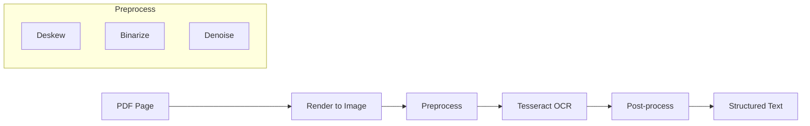
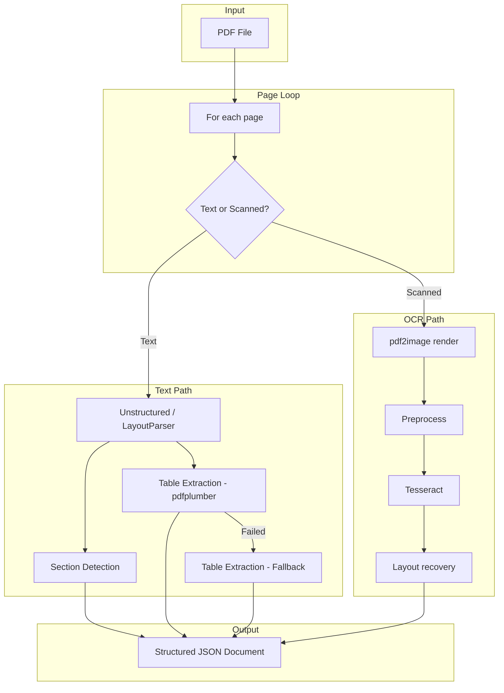

# Day 2: Advanced PDF Processing — Tables, Layout, OCR

## Learning Objectives

1. **Implement** layout-aware parsing with LayoutParser and Unstructured
2. **Extract** tables to structured format (CSV/JSON) with high fidelity
3. **Build** an OCR fallback pipeline using Tesseract
4. **Handle** form detection, multi-column parsing, section hierarchy
5. **Design** incremental reprocessing and change detection for document versions

---

## 1. Theory

### 1.1 Layout-Aware Parsing

Raw text extraction loses structure. **Layout-aware parsing** infers:
- **Reading order**: Top-to-bottom, column boundaries
- **Element types**: Title, paragraph, list, table, figure
- **Hierarchy**: Section → subsection → paragraph

**Approach 1 — Rule-based (LayoutParser)**  
Uses computer vision to detect:
- Text regions (bounding boxes)
- Table regions (grid detection)
- Figure regions

**Approach 2 — ML-based (Unstructured)**  
Uses models (e.g., YOLO, Detectron2) trained on document layouts. Higher accuracy, more compute.

**Approach 3 — Hybrid**  
Rules for simple docs; ML for complex layouts.

### 1.2 Table Extraction Strategies

| Strategy | Pros | Cons |
|----------|------|------|
| **Line-based** (pdfplumber) | Fast, works for grid tables | Fails on borderless tables |
| **CV-based** (Camelot, Tabula) | Handles some borderless | Brittle on complex layouts |
| **Deep learning** (TableTransformer) | Robust, handles merged cells | Slow, needs GPU |
| **LLM-based** | Flexible, handles ambiguity | Cost, latency |

**Tradeoff**: pdfplumber for 80% of tables; TableTransformer for edge cases.

### 1.3 OCR Pipeline Architecture



**Preprocessing** improves OCR accuracy:
- **Deskew**: Rotate to correct slant (Hough transform)
- **Binarize**: Convert to B&W (Otsu, adaptive threshold)
- **Denoise**: Remove speckles (morphological ops)

### 1.4 Section Hierarchy Detection

Headings often have:
- Larger font size
- Bold/italic
- Different vertical spacing
- Numbering (1., 1.1, etc.)

Algorithm:
1. Extract blocks with font info
2. Cluster by font size → potential headings
3. Infer hierarchy from numbering or indentation
4. Build tree: `Section → Subsection → Paragraph`

---

## 2. Architecture

### 2.1 Full PDF Pipeline (Day 2)



### 2.2 Metadata Schema for PDF Documents

```json
{
  "document_id": "sha256:abc123...",
  "source_path": "s3://bucket/docs/report.pdf",
  "content_hash": "sha256:def456...",
  "extraction_method": "text|ocr|hybrid",
  "page_count": 42,
  "pages": [
    {
      "page_num": 1,
      "method": "text",
      "elements": [
        {"type": "title", "text": "...", "bbox": [...], "font_size": 18},
        {"type": "table", "data": [[...]], "bbox": [...], "structure": "grid"}
      ],
      "tables": [{"rows": [...], "columns": [...]}]
    }
  ],
  "section_hierarchy": [
    {"level": 1, "title": "Introduction", "page_start": 1, "page_end": 2}
  ]
}
```

---

## 3. Mathematical Intuition

### 3.1 Deskew Angle (Hough Transform)

Projections of text lines produce peaks. The skew angle $\theta$ maximizes:
$$\theta^* = \arg\max_\theta \sum_{\text{lines}} \text{projection}(\text{line}, \theta)$$

Practical: use `opencv` HoughLines, compute median angle of detected lines.

### 3.2 OCR Confidence Aggregation

For page-level quality:
$$\text{PageScore} = \frac{\sum_i w_i \cdot \text{conf}_i}{\sum_i w_i}$$

where $w_i$ = length of word $i$. Longer words weighted more (typos less likely in short words).

---

## 4. Production Considerations

| Consideration | Approach |
|---------------|----------|
| **OCR latency** | Async queue; timeout 60s/page; skip on timeout |
| **Table structure** | Store as JSON (rows/cols); preserve for downstream |
| **Version tracking** | content_hash per page; reprocess only changed pages |
| **Incremental reprocessing** | Compare hashes; process delta only |
| **GPU for layout models** | Use for high-volume; batch inference |

---

## 5. Coding Lab

### Lab 5.1: OCR Fallback Pipeline

```python
# labs/week1/day02_ocr_pipeline.py
from pdf2image import convert_from_path
import pytesseract
from PIL import Image
import numpy as np
import cv2

def preprocess_for_ocr(image: Image.Image) -> np.ndarray:
    img = np.array(image)
    gray = cv2.cvtColor(img, cv2.COLOR_RGB2GRAY)
    # Binarize
    _, binary = cv2.threshold(gray, 0, 255, cv2.THRESH_BINARY + cv2.THRESH_OTSU)
    # Denoise
    denoised = cv2.fastNlMeansDenoising(binary, None, 10, 7, 21)
    return denoised

def ocr_page(pdf_path: str, page_num: int) -> tuple[str, float]:
    images = convert_from_path(pdf_path, first_page=page_num, last_page=page_num, dpi=300)
    if not images:
        return "", 0.0
    img = images[0]
    processed = preprocess_for_ocr(img)
    data = pytesseract.image_to_data(processed, output_type=pytesseract.Output.DICT)
    text = pytesseract.image_to_string(processed)
    # Compute confidence
    confidences = [int(c) for c in data['conf'] if c != '-1']
    avg_conf = sum(confidences) / len(confidences) / 100 if confidences else 0
    return text, avg_conf
```

### Lab 5.2: Table to Structured Format

```python
# labs/week1/day02_table_extraction.py
import pdfplumber
from pathlib import Path
import json

def extract_tables_structured(pdf_path: Path) -> list[dict]:
    results = []
    with pdfplumber.open(pdf_path) as pdf:
        for i, page in enumerate(pdf.pages):
            tables = page.find_tables()
            for t in tables:
                extracted = t.extract()
                if extracted:
                    results.append({
                        "page": i + 1,
                        "bbox": t.bbox,
                        "num_rows": len(extracted),
                        "num_cols": max(len(r) for r in extracted) if extracted else 0,
                        "data": extracted,
                        "json_schema": infer_schema(extracted)
                    })
    return results

def infer_schema(rows: list[list]) -> dict:
    """Infer column types from first N rows."""
    if not rows:
        return {}
    headers = rows[0] if rows else []
    return {"columns": [{"name": h or f"col_{i}", "index": i} for i, h in enumerate(headers)]}
```

### Lab 5.3: Unstructured Pipeline

```python
# pip install unstructured[pdf]
from unstructured.partition.auto import partition
from pathlib import Path

def extract_with_unstructured(pdf_path: Path) -> list[dict]:
    elements = partition(filename=str(pdf_path), strategy="hi_res")  # Uses layout model
    return [
        {"type": el.category, "text": str(el), "metadata": el.metadata.to_dict()}
        for el in elements
    ]
```

---

## 6. Homework

1. **Implement** section hierarchy detection from PyMuPDF blocks (use font size + position).
2. **Compare** pdfplumber vs Unstructured table extraction on 5 PDFs with tables. Report recall.
3. **Add** change detection: given old and new PDF, output list of changed page numbers.

---

## 7. Interview-Style Questions

**Q1:** How would you extract a table with merged cells?

**A:** pdfplumber fails. Use TableTransformer or similar DL model. Alternatively, render table region to image, use vision model to output HTML table. For production, Camelot lattice mode or Tabula with manual tuning.

**Q2:** What's the tradeoff between 150 DPI and 300 DPI for OCR?

**A:** 300 DPI: better accuracy, 4x more pixels, slower. 150 DPI: faster, good for clean scans. Use 300 for degraded documents; 150 for high-quality scans. A/B test on your corpus.

**Q3:** How do you handle PDFs that are actually images (e.g., screenshots)?

**A:** Same as scanned—render, OCR. May need higher DPI. Check: if PDF has 1 image per page covering full page, treat as scanned. Consider document classification (image-PDF vs true PDF) before processing.

---

## 8. Common Failure Modes

| Failure | Cause | Mitigation |
|---------|-------|------------|
| Table split across pages | Extraction per-page loses continuity | Detect table flow; merge rows across pages |
| Rotated text | OCR misses or misorients | Detect rotation; rotate image before OCR |
| Handwritten content | Tesseract trained on print | Use specialized model or skip |
| Form fields | Empty or filled—different handling | Detect form; extract field values separately |
| Poor scan quality | Low contrast, noise | Preprocess; consider rescanning for critical docs |

---

## 9. Optimization Checklist

- [ ] Use `hi_res` strategy in Unstructured only when needed (slower)
- [ ] Batch OCR pages where possible (multi-page PDFs)
- [ ] Cache table extraction (tables rarely change without page change)
- [ ] Set OCR timeout; fallback to raw image storage if timeout
- [ ] Log extraction method and confidence per page for debugging
