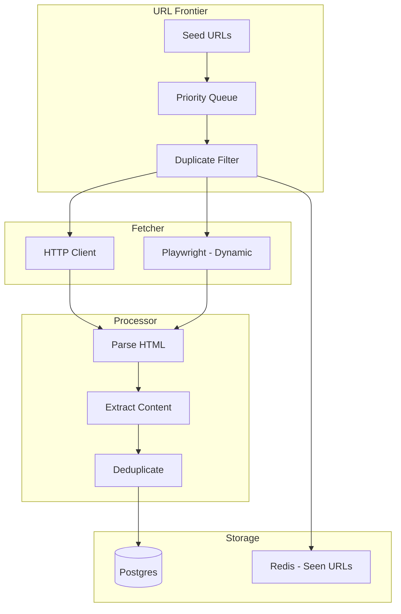
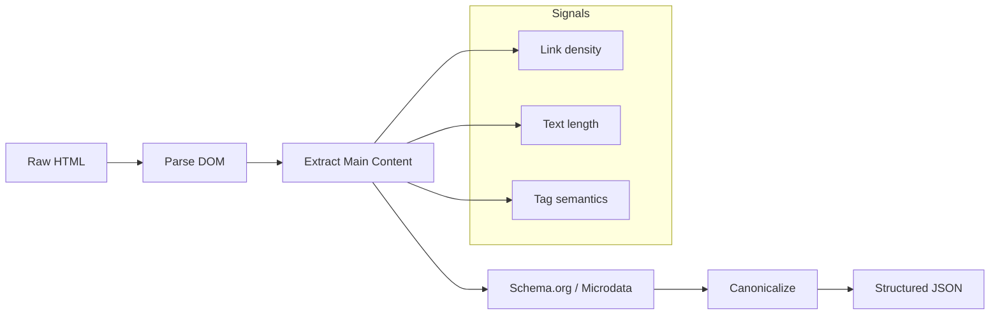

# Day 3: HTML Processing & Web Crawling Architecture

## Learning Objectives

1. **Implement** DOM parsing with BeautifulSoup and trafilatura for content extraction
2. **Design** a web crawler with deduplication, robots.txt, and sitemap support
3. **Build** boilerplate removal and structured content extraction (Schema.org)
4. **Handle** dynamic pages with Playwright
5. **Implement** change detection and incremental crawling

---

## 1. Theory

### 1.1 DOM Parsing vs Content Extraction

**DOM Parsing** (BeautifulSoup): Full HTML tree. Preserves structure but includes nav, ads, scripts.

**Content Extraction** (trafilatura, newspaper3k): Heuristic or ML-based main content detection. Strips boilerplate.

| Tool | Strategy | Best For |
|------|----------|----------|
| BeautifulSoup | Parse + selectors | Custom extraction, known structure |
| trafilatura | Readability + signals | Generic web pages, high recall |
| newspaper3k | NLP + heuristics | News articles |
| readability-lxml | Mozilla Readability | Simple, fast |

### 1.2 Boilerplate Removal Heuristics

- **Link density**: Main content has fewer links per text
- **Text density**: Long paragraphs vs short nav items
- **DOM depth**: Content often in deeper nodes
- **Class names**: `content`, `article`, `main` (noisy but useful)
- **Schema.org**: `Article`, `mainContentOfPage` — structured signals

### 1.3 Crawler Architecture



### 1.4 Deduplication Levels

1. **URL-level**: Canonical URL, redirect resolution
2. **Content-level**: SimHash or MinHash of main text (Day 2 Module 1)
3. **Semantic**: Embedding similarity (later weeks)

### 1.5 robots.txt and Sitemap

- **robots.txt**: Respect `Crawl-delay`, `Disallow`
- **Sitemap**: Parse `sitemap.xml`, `sitemap_index.xml` for URL discovery
- **Rate limiting**: Politeness delay (e.g., 1 req/sec per domain)

---

## 2. Architecture

### 2.1 Content Extraction Pipeline



### 2.2 Structured HTML-to-Chunks Converter

1. Extract main content
2. Split by headings (h1–h6) into sections
3. Each section → chunk with metadata: `{section_title, url, publish_date}`
4. Preserve hierarchy for parent-child chunking (Week 6)

---

## 3. Mathematical Intuition

### 3.1 Content Density Score

For a DOM node $n$:
$$\text{density}(n) = \frac{\text{charCount}(n)}{\text{linkCount}(n) + 1}$$

Main content maximizes density. Combine with subtree size for robustness.

### 3.2 SimHash for Near-Duplicate Detection (Preview)

64-bit fingerprint. Similar documents have small Hamming distance.
- Used in URL/content dedup
- Fast: O(n) for n words
- Threshold: Hamming distance < 3 → duplicate

---

## 4. Production Considerations

| Consideration | Approach |
|---------------|----------|
| **Dynamic pages** | Playwright/Puppeteer for JS-rendered content |
| **Rate limiting** | Per-domain politeness; exponential backoff on 429 |
| **Storage** | Raw HTML in blob; extracted content in Postgres |
| **Incremental** | Store content_hash; re-fetch if changed |
| **Scale** | Distributed crawlers (Scrapy, custom Celery) |

---

## 5. Coding Lab

### Lab 5.1: trafilatura Content Extraction

```python
# labs/week1/day03_html_extraction.py
import trafilatura
from trafilatura.extraction import extract_comments
import requests
from pathlib import Path

def extract_content(url: str = None, html: str = None) -> dict:
    if url:
        downloaded = trafilatura.fetch_url(url)
        html = downloaded
    if not html:
        return {}
    result = trafilatura.extract(
        html,
        include_comments=False,
        include_tables=True,
        no_fallback=False,
        output_format="json"
    )
    return result if result else {}

def extract_with_metadata(html: str) -> dict:
    metadata = trafilatura.extract_metadata(html)
    content = trafilatura.extract(html, output_format="txt")
    return {
        "title": metadata.title if metadata else None,
        "author": metadata.author if metadata else None,
        "date": metadata.date if metadata else None,
        "sitename": metadata.sitename if metadata else None,
        "content": content,
        "url": metadata.url if metadata else None
    }
```

### Lab 5.2: Web Crawler (Simplified)

```python
# labs/week1/day03_crawler.py
from urllib.robotparser import RobotFileParser
from urllib.parse import urljoin, urlparse
import hashlib
import redis
import requests
from bs4 import BeautifulSoup
import time

class SimpleCrawler:
    def __init__(self, redis_url: str = "redis://localhost:6379/0"):
        self.redis = redis.from_url(redis_url)
        self.seen_key = "crawler:seen_urls"
        self.delay = 1.0  # seconds per domain

    def can_fetch(self, url: str, user_agent: str = "BootcampBot/1.0") -> bool:
        parsed = urlparse(url)
        robots_url = f"{parsed.scheme}://{parsed.netloc}/robots.txt"
        rp = RobotFileParser()
        rp.set_url(robots_url)
        try:
            rp.read()
            return rp.can_fetch(user_agent, url)
        except:
            return True

    def seen(self, url: str) -> bool:
        h = hashlib.sha256(url.encode()).hexdigest()
        return self.redis.sismember(self.seen_key, h)

    def mark_seen(self, url: str):
        h = hashlib.sha256(url.encode()).hexdigest()
        self.redis.sadd(self.seen_key, h)

    def crawl(self, url: str) -> dict:
        if not self.can_fetch(url):
            return {"error": "Disallowed by robots.txt"}
        if self.seen(url):
            return {"error": "Already seen"}
        time.sleep(self.delay)
        resp = requests.get(url, timeout=10, headers={"User-Agent": "BootcampBot/1.0"})
        resp.raise_for_status()
        self.mark_seen(url)
        return {"url": url, "html": resp.text, "status": resp.status_code}
```

### Lab 5.3: Playwright Dynamic Page

```python
# labs/week1/day03_playwright.py
# pip install playwright && playwright install chromium
from playwright.sync_api import sync_playwright

def fetch_dynamic(url: str, wait_for: str = "networkidle") -> str:
    with sync_playwright() as p:
        browser = p.chromium.launch(headless=True)
        page = browser.new_page()
        page.goto(url, wait_until=wait_for)
        html = page.content()
        browser.close()
    return html
```

---

## 6. Homework

1. **Implement** sitemap ingestion: given a domain, fetch sitemap.xml and extract all URLs.
2. **Add** content-level dedup using SimHash (research `simhash` library).
3. **Build** change detection: store content hash per URL; on re-crawl, compare and flag changed.

---

## 7. Interview-Style Questions

**Q1:** How do you handle JavaScript-rendered content at scale?

**A:** Playwright/Puppeteer is expensive. Options: (1) Headless browser pool with queue; (2) Use services that pre-render (e.g., Prerender.io); (3) Check if content is in initial HTML (many SPAs embed data in JSON-LD). Prioritize by URL importance.

**Q2:** What's the risk of ignoring robots.txt?

**A:** Legal (ToS violation), ethical (server overload), and practical (IP blocks). Always respect robots.txt. Use Crawl-delay if specified.

**Q3:** How do you deduplicate near-duplicate articles (e.g., syndicated content)?

**A:** SimHash or MinHash on main text. Threshold ~3 bits difference. For higher recall, use embedding similarity. Store canonical URL; redirect duplicates to canonical.

---

## 8. Common Failure Modes

| Failure | Cause | Mitigation |
|---------|-------|------------|
| Empty extraction | JS-rendered, paywall | Playwright; detect paywall patterns |
| Wrong content | Multiple articles per page | Use trafilatura; refine selectors |
| Encoding issues | Non-UTF-8 | Detect encoding; convert |
| Blocked | Rate limit, bot detection | Politeness; rotate user agents (carefully) |
| Redirect chains | URL redirects | Resolve to final URL; store canonical |

---

## 9. Optimization Checklist

- [ ] Use trafilatura for generic extraction (best quality)
- [ ] Cache robots.txt per domain (TTL 24h)
- [ ] Use connection pooling for HTTP
- [ ] Implement breadth-first URL frontier for broad crawl
- [ ] Store raw HTML for reprocessing; extracted content for search
