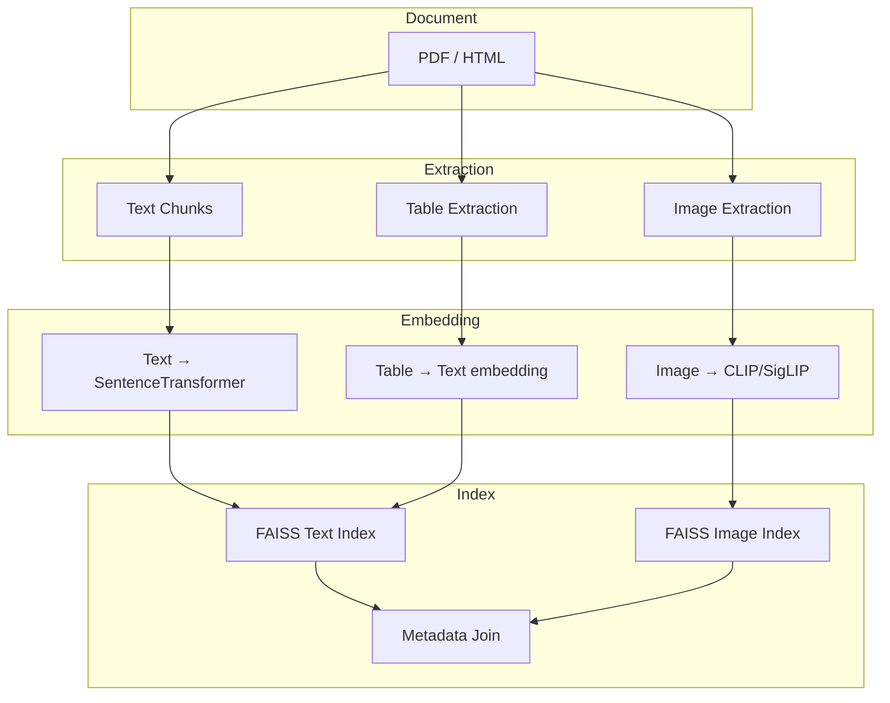
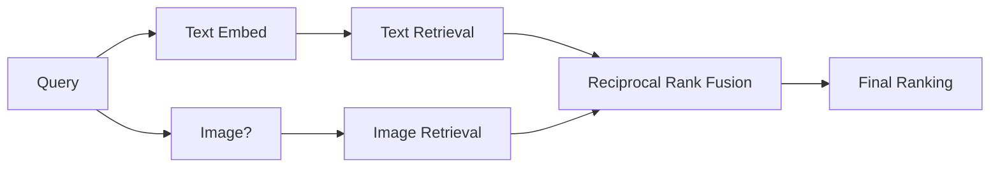

# Day 4: Multi-Modal Documents — Image + Text Retrieval

## Learning Objectives

1. **Implement** image extraction from PDFs and chart/table detection
2. **Generate** image embeddings using CLIP and SigLIP
3. **Build** multi-modal retrieval combining text and image vectors
4. **Design** multi-vector document schema for hybrid indexing
5. **Evaluate** retrieval quality for multi-modal queries

---

## 1. Theory

### 1.1 Multi-Modal Document Types

| Type | Example | Processing |
|------|---------|------------|
| **PDF with figures** | Research paper with diagrams | Extract images; generate captions or embeddings |
| **Chart/graph** | Bar chart in report | Extract; optionally OCR axis labels; embed |
| **Table as image** | Scanned table | OCR + structure; or embed as image |
| **Image + caption** | Photo with caption | Joint embedding or separate with linkage |
| **Slides** | PowerPoint, slide PDF | Per-slide image + text |

### 1.2 Vision-Language Models

**CLIP** (OpenAI): Contrastive pre-training on (image, text) pairs. Joint embedding space.  
**SigLIP**: Sigmoid loss variant; often better at fine-grained retrieval.  
**OpenCLIP**: Open-source CLIP variants (ViT-B/32, ViT-L/14, etc.)

Embedding space: image and text map to same dimension (e.g., 768). Similarity = cosine or dot product.

### 1.3 Multi-Vector Document Schema

A document can have multiple vectors:
- **Text chunks**: One embedding per chunk (standard RAG)
- **Image regions**: One embedding per figure
- **Table embeddings**: Text representation of table
- **Hybrid**: Combined text+image for figures with captions

Query: Can be text or image. Same embedding space.

### 1.4 Retrieval Strategies

| Strategy | Pros | Cons |
|----------|------|------|
| **Text-only** | Simple, fast | Misses visual information |
| **Image-only** | Good for visual queries | Misses text context |
| **Early fusion** | Concatenate text+image embeddings | Schema complexity |
| **Late fusion** | Retrieve separately; merge rankings (RRF) | Two indices; merge logic |
| **Cross-attention** | Joint encoding (e.g., LLaVA) | Expensive; not for retrieval |

**Recommendation**: Late fusion with Reciprocal Rank Fusion (RRF) for production.

---

## 2. Architecture

### 2.1 Multi-Modal Ingestion Pipeline



### 2.2 Hybrid Search (Late Fusion)



**RRF formula**: 
$$\text{score}(d) = \sum_{r \in \text{rankings}} \frac{1}{k + \text{rank}_r(d)}$$

Typical $k=60$. Combines rankings from multiple retrievers.

---

## 3. Mathematical Intuition

### 3.1 CLIP Contrastive Loss

For batch of (image, text) pairs:
$$\mathcal{L} = -\frac{1}{N} \sum_i \log \frac{\exp(s_{i,i}/\tau)}{\sum_j \exp(s_{i,j}/\tau)}$$

where $s_{i,j}$ = cosine similarity of image $i$ and text $j$, $\tau$ = temperature.

Result: Aligned embedding space. Similar images and describing text have high similarity.

### 3.2 Normalization for Dot Product

For unit vectors: $\cos(a,b) = a \cdot b$. FAISS uses inner product when vectors are L2-normalized.

---

## 4. Production Considerations

| Consideration | Approach |
|---------------|----------|
| **Image size** | Resize to model input (e.g., 224x224); preserve aspect or pad |
| **Batch embedding** | Batch images for GPU efficiency |
| **Storage** | Store image vectors separately; join by doc_id at query time |
| **Index choice** | Separate FAISS index for images or unified with type metadata |
| **Cost** | CLIP inference ~10–50ms/image on GPU; plan capacity |

---

## 5. Coding Lab

### Lab 5.1: Image Extraction from PDF

```python
# labs/week1/day04_image_extraction.py
import fitz  # PyMuPDF
from pathlib import Path
from PIL import Image
import io

def extract_images_from_pdf(pdf_path: Path) -> list[dict]:
    doc = fitz.open(pdf_path)
    images = []
    for page_num in range(len(doc)):
        page = doc[page_num]
        img_list = page.get_images(full=True)
        for img_index, img_info in enumerate(img_list):
            xref = img_info[0]
            base_image = doc.extract_image(xref)
            img_bytes = base_image["image"]
            img_ext = base_image["ext"]
            # Filter small images (icons, bullets)
            if base_image["width"] < 50 or base_image["height"] < 50:
                continue
            images.append({
                "page": page_num + 1,
                "index": img_index,
                "bytes": img_bytes,
                "format": img_ext,
                "width": base_image["width"],
                "height": base_image["height"],
                "bbox": page.get_image_bbox(img_info)
            })
    doc.close()
    return images
```

### Lab 5.2: CLIP Embeddings

```python
# labs/week1/day04_clip_embeddings.py
from transformers import CLIPProcessor, CLIPModel
from PIL import Image
import torch

model = CLIPModel.from_pretrained("openai/clip-vit-base-patch32")
processor = CLIPProcessor.from_pretrained("openai/clip-vit-base-patch32")

def embed_image(image: Image.Image) -> list[float]:
    inputs = processor(images=image, return_tensors="pt")
    with torch.no_grad():
        features = model.get_image_features(**inputs)
    return features.normalize(dim=-1).squeeze().tolist()

def embed_text(text: str) -> list[float]:
    inputs = processor(text=[text], return_tensors="pt", padding=True, truncation=True)
    with torch.no_grad():
        features = model.get_text_features(**inputs)
    return features.normalize(dim=-1).squeeze().tolist()

def similarity(image_emb: list[float], text_emb: list[float]) -> float:
    return sum(a * b for a, b in zip(image_emb, text_emb))  # Dot product, normalized
```

### Lab 5.3: Multi-Vector Index

```python
# labs/week1/day04_multivector_index.py
import faiss
import numpy as np
from typing import List, Tuple

class MultiVectorIndex:
    def __init__(self, dim: int):
        self.text_index = faiss.IndexFlatIP(dim)  # Inner product for normalized
        self.image_index = faiss.IndexFlatIP(dim)
        self.text_metadata = []  # [(doc_id, chunk_id, type), ...]
        self.image_metadata = []

    def add_text(self, embedding: np.ndarray, doc_id: str, chunk_id: str):
        emb = np.array(embedding, dtype=np.float32).reshape(1, -1)
        faiss.normalize_L2(emb)
        self.text_index.add(emb)
        self.text_metadata.append((doc_id, chunk_id, "text"))

    def add_image(self, embedding: np.ndarray, doc_id: str, image_id: str):
        emb = np.array(embedding, dtype=np.float32).reshape(1, -1)
        faiss.normalize_L2(emb)
        self.image_index.add(emb)
        self.image_metadata.append((doc_id, image_id, "image"))

    def search_hybrid(self, text_emb: np.ndarray, image_emb: np.nd32 = None, k: int = 10, rrf_k: int = 60):
        def rrf_score(ranks: List[int]) -> float:
            return sum(1 / (rrf_k + r) for r in ranks)
        text_emb = text_emb.astype(np.float32).reshape(1, -1)
        faiss.normalize_L2(text_emb)
        _, text_ids, text_scores = self._search_index(self.text_index, text_emb, k * 2)
        doc_scores = {}
        for rank, idx in enumerate(text_ids[0]):
            meta = self.text_metadata[idx]
            doc_scores[meta[0]] = doc_scores.get(meta[0], []) + [rank + 1]
        if image_emb is not None:
            image_emb = image_emb.astype(np.float32).reshape(1, -1)
            faiss.normalize_L2(image_emb)
            _, img_ids, _ = self._search_index(self.image_index, image_emb, k * 2)
            for rank, idx in enumerate(img_ids[0]):
                meta = self.image_metadata[idx]
                doc_scores[meta[0]] = doc_scores.get(meta[0], []) + [rank + 1]
        # RRF
        ranked = [(doc_id, rrf_score(ranks)) for doc_id, ranks in doc_scores.items()]
        ranked.sort(key=lambda x: x[1], reverse=True)
        return ranked[:k]

    def _search_index(self, index, emb, k):
        return index.search(emb, min(k, index.ntotal))
```

---

## 6. Homework

1. **Implement** caption extraction: find text blocks near image bbox (below or beside).
2. **Benchmark** retrieval: 100 text queries, 50 image queries. Compare text-only vs hybrid recall@10.
3. **Research** SigLIP: when is it preferred over CLIP?

---

## 7. Interview-Style Questions

**Q1:** How do you handle a query that's both text and image (e.g., "find documents similar to this diagram")?

**A:** Embed both. Use late fusion: retrieve from text index with text embedding, from image index with image embedding. Merge with RRF. Return unified ranking.

**Q2:** What if your corpus is mostly text with few images?

**A:** Text index dominates. Image index adds recall for visual queries. Weight RRF by index size or by query type detection. If query is image, boost image index contribution.

**Q3:** How do you reduce storage for image embeddings?

**A:** Quantization (PQ, SQ); dimensionality reduction (PCA); use smaller model (ViT-B vs ViT-L). Trade recall for storage. Benchmark before adopting.

---

## 8. Common Failure Modes

| Failure | Cause | Mitigation |
|---------|-------|------------|
| Poor image-text match | Domain shift (CLIP on medical images) | Fine-tune or use domain-specific model |
| Slow embedding | CPU inference | Use GPU; batch; consider smaller model |
| Index imbalance | 99% text, 1% image | Separate indices; query routing |
| Caption mismatch | Caption far from image | Use spatial proximity; joint embedding |

---

## 9. Optimization Checklist

- [ ] Use OpenCLIP for flexibility (multiple sizes)
- [ ] Batch image embedding (8–32 per batch on GPU)
- [ ] Cache embeddings by content hash
- [ ] Consider SigLIP for retrieval-focused use cases
- [ ] Evaluate on your domain before production
