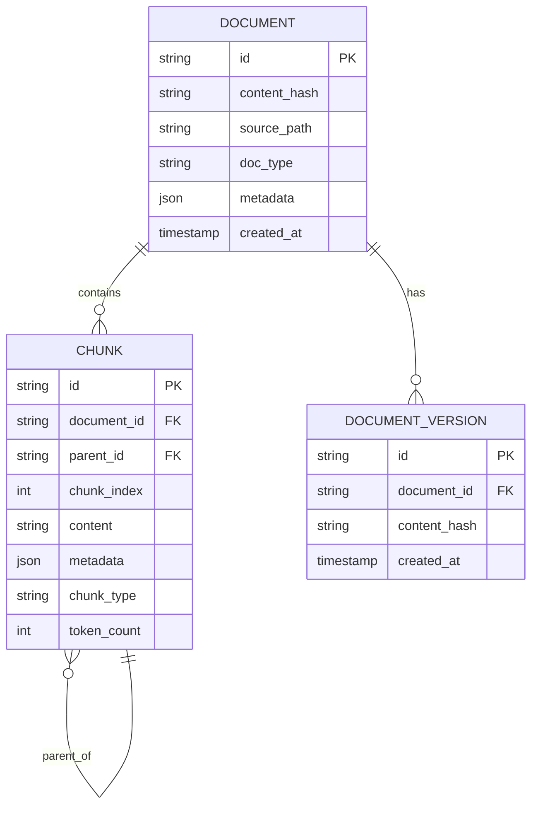

# Day 5: Document Schema & Storage — Chunking for Complex Documents

## Learning Objectives

1. **Design** canonical document JSON schema with chunk-level metadata
2. **Implement** section-aware and table-aware chunking
3. **Define** Postgres schema for documents, chunks, and version history
4. **Handle** parent-child relationships and section hierarchy
5. **Implement** chunk coherence scoring and recall evaluation

---

## 1. Theory

### 1.1 Canonical Document Schema

A **canonical schema** enables:
- Interoperability across parsers (PDF, HTML, etc.)
- Consistent chunking and indexing
- Version tracking and reprocessing
- Audit and lineage

### 1.2 Chunking Strategies for Complex Documents

| Strategy | Use Case | Pros | Cons |
|----------|----------|------|------|
| **Fixed-size** | Simple docs | Fast, predictable | Cuts mid-sentence |
| **Sentence boundary** | General text | Clean boundaries | Variable length |
| **Section-aware** | Technical docs | Respects structure | Needs structure |
| **Table-aware** | Reports | Keeps tables intact | Complex logic |
| **Recursive** | Mixed content | Handles nested structure | More compute |
| **Semantic** | Optimal retrieval | Best recall | Slow; needs model |

### 1.3 Parent-Child Chunking

- **Parent**: Larger chunk (e.g., full section) — for overview retrieval
- **Child**: Smaller chunk (e.g., paragraph) — for precision
- **Relationship**: child.parent_id = parent.id
- **Retrieval**: Retrieve children; optionally include parent for context

### 1.4 Metadata Propagation

Every chunk inherits:
- document_id, source_url, doc_type
- section_title, section_level
- page_start, page_end (for PDFs)
- extraction_method (text/ocr)

---

## 2. Architecture

### 2.1 Document and Chunk Schema



### 2.2 Canonical JSON Document

```json
{
  "document_id": "doc_sha256_abc123",
  "content_hash": "sha256_def456",
  "source": {
    "type": "pdf",
    "path": "s3://bucket/docs/report.pdf",
    "url": null
  },
  "metadata": {
    "title": "Q4 Report",
    "author": "Finance Team",
    "created_date": "2024-01-15",
    "page_count": 42
  },
  "sections": [
    {
      "id": "sec_1",
      "level": 1,
      "title": "Executive Summary",
      "page_start": 1,
      "page_end": 2,
      "children": ["sec_1_1", "sec_1_2"]
    }
  ],
  "chunks": [
    {
      "id": "chunk_001",
      "document_id": "doc_sha256_abc123",
      "parent_id": null,
      "section_id": "sec_1",
      "content": "...",
      "chunk_type": "paragraph",
      "metadata": {
        "page_start": 1,
        "page_end": 1,
        "section_title": "Executive Summary"
      },
      "token_count": 128
    }
  ]
}
```

---

## 3. Mathematical Intuition

### 3.1 Chunk Coherence Score

For chunk $c$ with sentences $s_1, \ldots, s_n$:
$$\text{coherence}(c) = \frac{1}{n-1} \sum_{i=1}^{n-1} \text{sim}(s_i, s_{i+1})$$

where $\text{sim}$ = embedding cosine similarity. High coherence → chunk is topically consistent.

### 3.2 Retrieval Recall for Chunk Strategy

Given query $q$ and relevant chunks $R$:
$$\text{Recall@k} = \frac{|R \cap \text{retrieved}_k|}{|R|}$$

Compare strategies: fixed-512 vs section-aware vs semantic. Measure on labeled query-chunk pairs.

---

## 4. Production Considerations

| Consideration | Approach |
|---------------|----------|
| **Blob storage** | Raw docs in S3; metadata + chunks in Postgres |
| **Redis caching** | Cache recent documents; chunk lists by doc_id |
| **Versioning** | content_hash per doc; store versions for audit |
| **Large docs** | Stream chunking; avoid loading full doc in memory |
| **Rebuild** | On schema change, reprocess; use content_hash to skip unchanged |

---

## 5. Coding Lab

### Lab 5.1: Canonical Schema (Pydantic)

```python
# labs/week1/day05_schema.py
from pydantic import BaseModel, Field
from typing import Optional
from enum import Enum

class DocType(str, Enum):
    PDF = "pdf"
    HTML = "html"
    MD = "markdown"

class ChunkType(str, Enum):
    PARAGRAPH = "paragraph"
    TABLE = "table"
    LIST = "list"
    TITLE = "title"

class ChunkMetadata(BaseModel):
    page_start: Optional[int] = None
    page_end: Optional[int] = None
    section_title: Optional[str] = None
    section_level: Optional[int] = None
    chunk_type: ChunkType = ChunkType.PARAGRAPH

class Chunk(BaseModel):
    id: str
    document_id: str
    parent_id: Optional[str] = None
    section_id: Optional[str] = None
    content: str
    metadata: ChunkMetadata = Field(default_factory=ChunkMetadata)
    token_count: int = 0

class Section(BaseModel):
    id: str
    level: int
    title: str
    page_start: Optional[int] = None
    page_end: Optional[int] = None
    children: list[str] = Field(default_factory=list)

class CanonicalDocument(BaseModel):
    document_id: str
    content_hash: str
    source: dict
    metadata: dict = Field(default_factory=dict)
    sections: list[Section] = Field(default_factory=list)
    chunks: list[Chunk] = Field(default_factory=list)
```

### Lab 5.2: Section-Aware Chunking

```python
# labs/week1/day05_chunking.py
from typing import List
import tiktoken

def section_aware_chunk(
    sections: List[dict],
    max_tokens: int = 512,
    overlap_tokens: int = 50
) -> List[dict]:
    chunks = []
    enc = tiktoken.get_encoding("cl100k_base")
    for sec in sections:
        content = sec.get("content", "")
        tokens = enc.encode(content)
        for i in range(0, len(tokens), max_tokens - overlap_tokens):
            chunk_tokens = tokens[i:i + max_tokens]
            chunk_text = enc.decode(chunk_tokens)
            chunks.append({
                "content": chunk_text,
                "section_id": sec["id"],
                "section_title": sec.get("title", ""),
                "token_count": len(chunk_tokens)
            })
    return chunks
```

### Lab 5.3: Postgres Schema

```sql
-- labs/week1/day05_schema.sql
CREATE TABLE documents (
    id VARCHAR(64) PRIMARY KEY,
    content_hash VARCHAR(64) NOT NULL,
    source_path TEXT,
    doc_type VARCHAR(32),
    metadata JSONB DEFAULT '{}',
    created_at TIMESTAMPTZ DEFAULT NOW()
);

CREATE TABLE chunks (
    id VARCHAR(64) PRIMARY KEY,
    document_id VARCHAR(64) REFERENCES documents(id) ON DELETE CASCADE,
    parent_id VARCHAR(64) REFERENCES chunks(id),
    chunk_index INT NOT NULL,
    content TEXT NOT NULL,
    metadata JSONB DEFAULT '{}',
    chunk_type VARCHAR(32),
    token_count INT,
    embedding_id VARCHAR(64)  -- Reference to vector store
);

CREATE INDEX idx_chunks_document ON chunks(document_id);
CREATE INDEX idx_chunks_parent ON chunks(parent_id);
CREATE INDEX idx_documents_hash ON documents(content_hash);

CREATE TABLE document_versions (
    id SERIAL PRIMARY KEY,
    document_id VARCHAR(64) REFERENCES documents(id),
    content_hash VARCHAR(64),
    created_at TIMESTAMPTZ DEFAULT NOW()
);
```

### Lab 5.4: Chunk Coherence Scoring

```python
# labs/week1/day05_coherence.py
from sentence_transformers import SentenceTransformer
import numpy as np

def chunk_coherence(chunk_text: str, model: SentenceTransformer) -> float:
    sentences = [s.strip() for s in chunk_text.split(". ") if s.strip()]
    if len(sentences) < 2:
        return 1.0
    embs = model.encode(sentences)
    similarities = [
        np.dot(embs[i], embs[i+1]) / (np.linalg.norm(embs[i]) * np.linalg.norm(embs[i+1]))
        for i in range(len(embs) - 1)
    ]
    return float(np.mean(similarities))
```

---

## 6. Homework

1. **Implement** table-aware chunking: keep tables as single chunks; add adjacent context.
2. **Build** chunk strategy comparison: fixed-256, section-aware, semantic. Measure recall@10 on 20 queries.
3. **Design** Redis caching for document metadata: TTL, invalidation on update.

---

## 7. Interview-Style Questions

**Q1:** How do you chunk a document with tables and figures?

**A:** Extract structure first. Tables → single chunk each. Figures → chunk with caption. Paragraphs → section-aware or sentence-boundary. Preserve parent-child: section is parent of its chunks. Metadata: chunk_type, section_id.

**Q2:** What's the tradeoff between small vs large chunks?

**A:** Small: precise retrieval, more chunks, higher storage. Large: more context per chunk, fewer chunks, may dilute relevance. Optimal depends on query type. Often use 256–512 tokens. Parent-child gives both.

**Q3:** How do you handle footnote citations in chunks?

**A:** Option 1: Include footnote in chunk. Option 2: Separate chunk for footnotes; link by ref. Option 3: Expand footnote inline (replace [1] with actual text). Depends on retrieval need. For legal/academic, preserve citations.

---

## 8. Common Failure Modes

| Failure | Cause | Mitigation |
|---------|-------|------------|
| Mid-sentence cut | Fixed-size, wrong boundary | Sentence or paragraph boundary |
| Table split | Chunking ignores structure | Table-aware chunker |
| Lost context | Chunk too isolated | Overlap; parent-child |
| Duplicate chunks | Overlap too large | Dedup by content hash |
| Token drift | Tokenizer mismatch | Use same tokenizer as embedding model |

---

## 9. Optimization Checklist

- [ ] Use tiktoken for token counting (OpenAI compatibility)
- [ ] Propagate metadata to every chunk
- [ ] Store section hierarchy for navigation
- [ ] Index chunks by document_id for bulk operations
- [ ] Benchmark chunk strategies on your corpus
