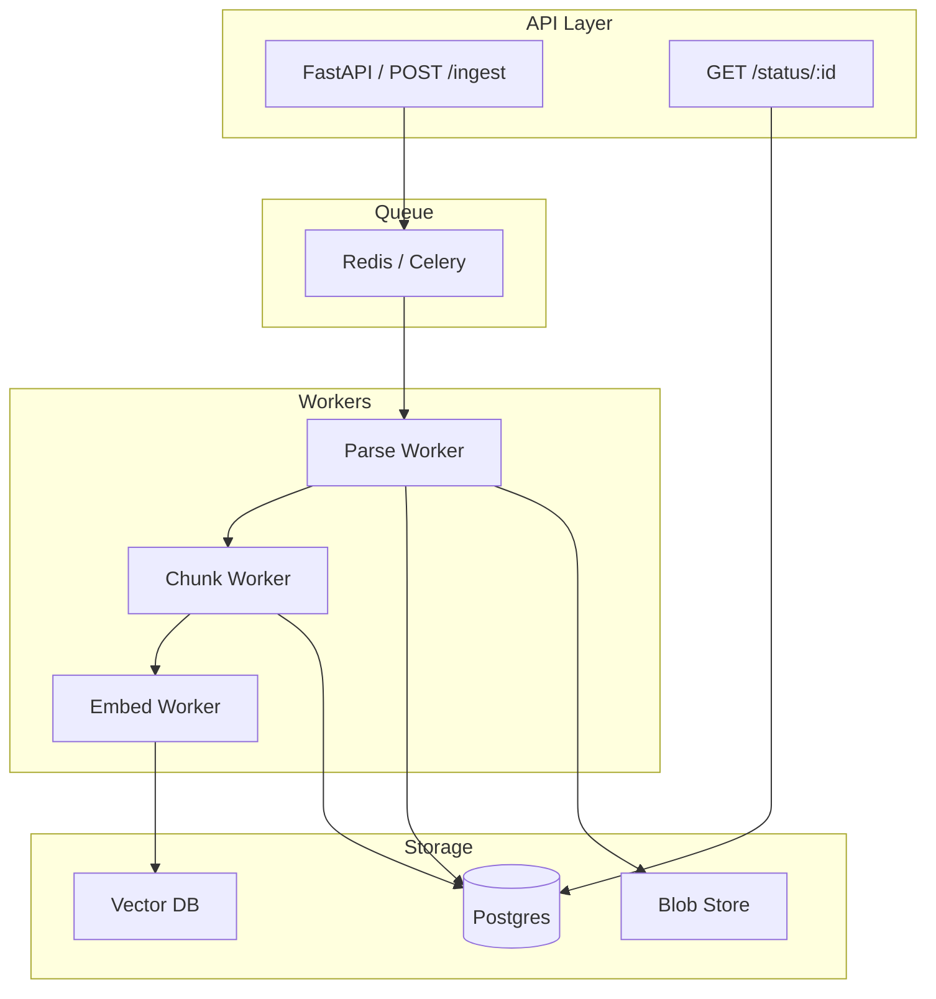
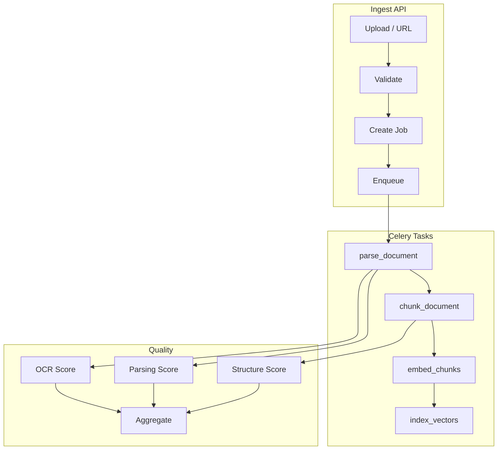

# Day 6: Ingestion Pipeline, Quality Evaluation & Production Patterns

## Learning Objectives

1. **Build** the complete ingestion microservice with FastAPI
2. **Implement** asynchronous pipeline with Celery
3. **Design** document reprocessing and failure handling
4. **Create** quality evaluation system (parsing, structure, OCR confidence)
5. **Implement** ingestion monitoring and observability

---

## 1. Theory

### 1.1 Ingestion Microservice Architecture



### 1.2 Async Processing Rationale

- **Throughput**: API returns immediately; processing in background
- **Resilience**: Failed jobs can retry; no request timeout
- **Scalability**: Add workers for horizontal scale
- **Backpressure**: Queue depth signals capacity

### 1.3 Document Reprocessing

Triggers:
- **Content change**: New version uploaded; content_hash differs
- **Parser update**: Bug fix or new feature
- **Chunk strategy change**: Reprocess all for new strategy
- **Schema migration**: Rebuild from raw storage

Strategy: Idempotent by content_hash. Reprocess = delete old chunks, re-ingest.

### 1.4 Quality Metrics

| Metric | Description | Threshold |
|--------|-------------|-----------|
| **Parsing quality** | % of pages with non-empty extraction | > 95% |
| **Structural completeness** | Sections detected / expected | Configurable |
| **OCR confidence** | Mean Tesseract confidence per page | > 85 |
| **Chunk coherence** | Mean coherence score | > 0.6 |
| **Data loss** | Chars in vs chars out | < 5% loss |

---

## 2. Architecture

### 2.1 Full Ingestion Pipeline



### 2.2 Failure Handling Patterns

| Pattern | Use Case | Implementation |
|---------|----------|----------------|
| **Retry** | Transient (network, lock) | Celery `retry(max_retries=3, countdown=60)` |
| **Dead letter** | Permanent (corrupt file) | Move to DLQ; alert |
| **Fallback** | Parser failure | Try alternative parser |
| **Partial success** | 1 of N pages fail | Process rest; flag failed pages |
| **Circuit breaker** | Downstream service | Stop sending; retry later |

---

## 3. Mathematical Intuition

### 3.1 Parsing Quality Score

$$\text{parse\_score} = \frac{\text{pages\_with\_content}}{\text{total\_pages}} \times \frac{\min(\text{chars\_extracted}, \text{expected})}{\text{expected}}$$

Expected chars can be estimated from page count × average (e.g., 2000 chars/page).

### 3.2 Data Loss Detection

$$\text{loss} = 1 - \frac{\sum \text{chunk\_lengths}}{\text{original\_doc\_length}}$$

Significant loss may indicate extraction or chunking issues.

---

## 4. Production Considerations

| Consideration | Approach |
|---------------|----------|
| **Idempotency** | content_hash; skip if processed |
| **Concurrency** | Celery worker concurrency; limit OCR workers |
| **Monitoring** | Prometheus: queue depth, latency, error rate |
| **Alerting** | DLQ depth > N; error rate > 5% |
| **Cost** | Batch embedding; cache; prioritize critical docs |

---

## 5. Coding Lab

### Lab 5.1: FastAPI Ingestion Endpoint

```python
# src/ingestion/main.py
from fastapi import FastAPI, BackgroundTasks, HTTPException
from pydantic import BaseModel
from typing import Optional
import hashlib
import uuid
from celery_app import ingest_document_task

app = FastAPI(title="Document Ingestion Service")

class IngestRequest(BaseModel):
    source_url: Optional[str] = None
    document_base64: Optional[str] = None  # For direct upload

@app.post("/ingest")
async def ingest(request: IngestRequest, background_tasks: BackgroundTasks):
    if request.source_url:
        content_hash = hashlib.sha256(request.source_url.encode()).hexdigest()
        job_id = str(uuid.uuid4())
        ingest_document_task.delay(job_id=job_id, source_url=request.source_url)
    elif request.document_base64:
        import base64
        raw = base64.b64decode(request.document_base64)
        content_hash = hashlib.sha256(raw).hexdigest()
        job_id = str(uuid.uuid4())
        ingest_document_task.delay(job_id=job_id, document_base64=request.document_base64)
    else:
        raise HTTPException(400, "Provide source_url or document_base64")
    return {"job_id": job_id, "content_hash": content_hash, "status": "queued"}

@app.get("/status/{job_id}")
async def status(job_id: str):
    # Query Celery result or DB
    return {"job_id": job_id, "status": "processing", "progress": 0.5}
```

### Lab 5.2: Celery Tasks

```python
# src/ingestion/tasks.py
from celery import Celery
from celery_app import celery_app

@celery_app.task(bind=True, max_retries=3)
def ingest_document_task(self, job_id: str, source_url: str = None, document_base64: str = None):
    try:
        # 1. Fetch/load document
        if source_url:
            doc_bytes = fetch_url(source_url)
        else:
            import base64
            doc_bytes = base64.b64decode(document_base64)
        # 2. Parse (PDF/HTML)
        parsed = parse_document(doc_bytes)
        # 3. Chunk
        chunks = chunk_document(parsed)
        # 4. Store
        store_document(parsed, chunks)
        # 5. Quality scoring
        score = compute_quality(parsed, chunks)
        return {"job_id": job_id, "status": "completed", "quality_score": score}
    except Exception as e:
        self.retry(exc=e, countdown=60)
```

### Lab 5.3: Quality Evaluation

```python
# labs/week1/day06_quality.py
from dataclasses import dataclass

@dataclass
class QualityReport:
    parsing_score: float
    structure_score: float
    ocr_confidence: float
    chunk_coherence: float
    data_loss_ratio: float
    overall: float

def evaluate_document(parsed: dict, chunks: list) -> QualityReport:
    pages = parsed.get("pages", [])
    total_pages = len(pages)
    pages_with_content = sum(1 for p in pages if p.get("char_count", 0) > 50)
    parsing_score = pages_with_content / total_pages if total_pages else 0
    ocr_confs = [p.get("ocr_confidence", 1.0) for p in pages if "ocr_confidence" in p]
    ocr_confidence = sum(ocr_confs) / len(ocr_confs) if ocr_confs else 1.0
    original_len = sum(len(p.get("text", "")) for p in pages)
    chunk_len = sum(len(c.get("content", "")) for c in chunks)
    data_loss = 1 - (chunk_len / original_len) if original_len else 0
    structure_score = len(parsed.get("sections", [])) / max(len(pages) // 5, 1)
    structure_score = min(1.0, structure_score)
    overall = (parsing_score * 0.3 + structure_score * 0.2 + ocr_confidence * 0.3 + (1 - data_loss) * 0.2)
    return QualityReport(
        parsing_score=parsing_score,
        structure_score=structure_score,
        ocr_confidence=ocr_confidence,
        chunk_coherence=0.0,  # Compute with embeddings
        data_loss_ratio=data_loss,
        overall=overall
    )
```

### Lab 5.4: Dockerfile

```dockerfile
# deployment/Dockerfile.ingestion
FROM python:3.11-slim

WORKDIR /app
COPY requirements.txt .
RUN pip install --no-cache-dir -r requirements.txt
COPY src/ src/
COPY labs/ labs/

ENV PYTHONPATH=/app
CMD ["uvicorn", "src.ingestion.main:app", "--host", "0.0.0.0", "--port", "8000"]
```

### Lab 5.5: Prometheus Metrics (FastAPI)

```python
# src/ingestion/metrics.py
from prometheus_client import Counter, Histogram

INGEST_REQUESTS = Counter("ingest_requests_total", "Total ingest requests", ["status"])
INGEST_LATENCY = Histogram("ingest_latency_seconds", "Ingest processing latency")
QUEUE_DEPTH = Gauge("ingest_queue_depth", "Celery queue depth")
```

---

## 6. Homework

1. **Implement** full pipeline: parse → chunk → embed → index. Add Celery chain.
2. **Add** unit tests for parsers (PDF, HTML) with sample files.
3. **Create** Grafana dashboard JSON for ingestion metrics.

---

## 7. Interview-Style Questions

**Q1:** How do you handle a burst of 10,000 documents?

**A:** Queue absorbs burst. Workers process at steady rate. Monitor queue depth; scale workers if depth grows. Prioritize by doc importance. Consider separate queues: fast (text) vs slow (OCR).

**Q2:** What if embedding service is down?

**A:** Store parsed+chunked docs. Retry embedding task with backoff. Option: dead-letter for manual retry. Circuit breaker to stop sending to embedding service.

**Q3:** How do you ensure exactly-once processing?

**A:** Idempotency key = content_hash. Before processing, check if hash exists. If yes, skip or update. Use DB unique constraint on content_hash. Celery task idempotent: same input → same output.

---

## 8. Common Failure Modes

| Failure | Cause | Mitigation |
|---------|-------|------------|
| Queue backup | Workers too slow | Scale workers; optimize per-doc time |
| Memory OOM | Large PDF in worker | Stream processing; limit page batch |
| Duplicate processing | Same doc submitted twice | content_hash check before enqueue |
| Stale state | Worker dies mid-task | Idempotent tasks; checkpoint progress |
| Downstream timeout | Vector DB slow | Retry; async indexing |

---

## 9. Optimization Checklist

- [ ] Use connection pooling for DB and Redis
- [ ] Batch embed requests (e.g., 32 chunks at a time)
- [ ] Compress payloads in queue (large base64)
- [ ] Set task time limits (e.g., 300s) to prevent stuck workers
- [ ] Monitor: queue depth, P99 latency, error rate by task type
